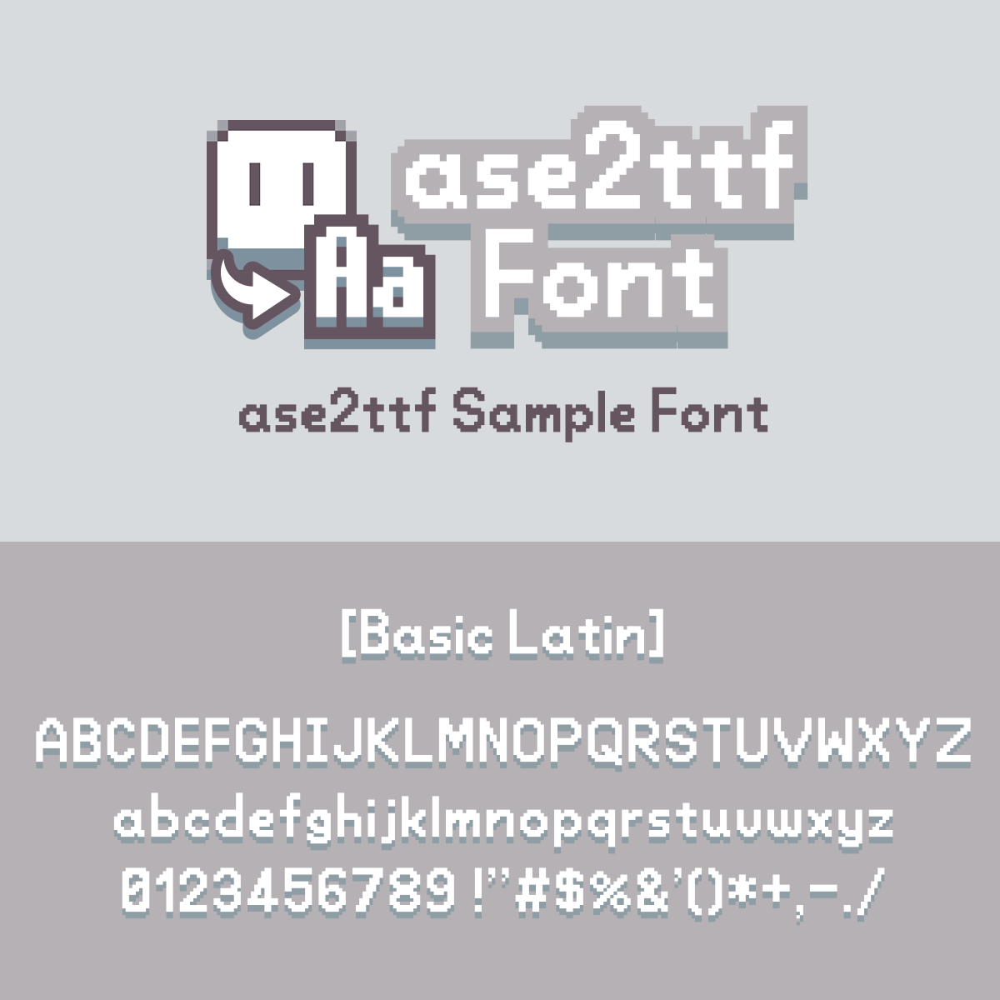

# ase2ttf Font

ase2ttf Font is a pixel font created for the [ase2ttf.com](ase2ttf.com) website. It features a typeface that combines the warmth of handwriting with a systematic and sophisticated impression, and includes 93 characters including alphanumeric characters and symbols.

It is released under the SIL Open Font License, so it can be used freely, including for commercial purposes.

## Changelog

### Version 1.0

* Released